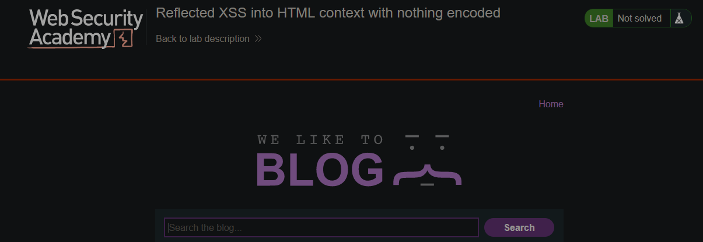

# CTF Challenge - Reflected XSS into HTML context with nothing encoded
## Introduction
- The lab contains a simple reflected XSS vulnerability in the search functionality. To solve the lab, we need to perform a XSS attack that calls the `alert` function

## Steps
1. This is the website we're dealing with:  
  
